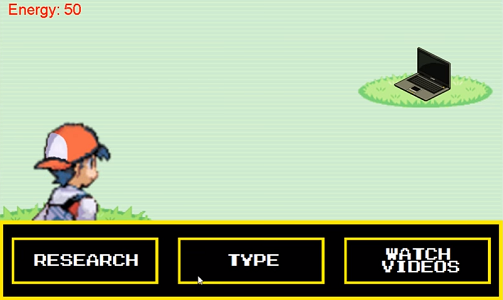
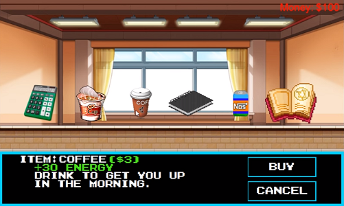

<div class="ui small rounded images">
  
  
</div>

This project was created in Spring 2016 as a final project for ICS 111 -the first course for Java Object-Oriented Programming. My partner and I created a game which combined RPG and point-and-click aspects. The objective of the game is to "battle" college assignments to achieve a passing grade to win. The player must monitor their energy to ensure they are able to "battle" the assignments, they may also use purchased items from the shop to restore energy or increase their grade. 

Because there were only two of us, the work for this project was evenly split between my partner and I. 
For this project I found the images/music, created the text boxes, created the class for the sprite to move and interact with assignments, created the class for the "battle" sequences, and created functions to determine the end game results.

You can see a demonstration of the program here [YouTube](https://www.youtube.com/watch?v=Ug-7pg_gx9o&t=7s)

Included below is a function from the "Character" class used to animate the sprite when the player moved it upwards. This was the first programming class I took and it really sparked my interest in coding since most of our programs included animation and gaming. Looking back on this code, I think I could write more concise code with less comments. In this course we also used a class that contained functions written by the professor's previous students to simplify coding to a display; I'd be interested in creating more projects like this in the future, it could be a good reminder of what I like about programming and help me to discover other fields I'm interested in.

```
void goUp(){ //create function called goUp that returns type void
   for(int i=0; i<UPsequence.size(); i++){//create for loop that declares int i and initializes it with 0,     
            performs loop when i is less than the size of the UPsequence, and adds one to i after each loop
	DOWNsequence.get(i).hide(); //hide object in index i of the arraylist DOWNsequence
	RIGHTsequence.get(i).hide(); //hide object in index i of the arraylist RIGHTsequence
	LEFTsequence.get(i).hide(); //hide object in index i of the arraylist LEFTsequence
   }
   counter++; //add one to counter
   if(counter == TIME_STEP){ //if counter is the same value as TIME_STEP
	counter = 0; //set counter to 0
	posy = posy-15; //initialize posy with posy-15
	int next_index = (index+1)%UPsequence.size(); //declare int called next_index and initialize it with the remainder of 
		(index+1)/the UPsequence size
	UPsequence.get(index).hide(); //hide object in index of the arraylist UPsequence
	UPsequence.get(next_index).show(); //show object in next_index of the arraylist UPsequence
	index = next_index; //initialize index with next_index
	UPsequence.get(index).translateTo(posx, posy-15); //translate the index of UPsequence to (posx, posy-15)
   }
}
```


