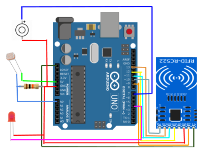

This project was completed using Arduino Uno to develop skills in building circuits and programming, and to introduce students to microcontrollers and creating mobile apps. Before creating our own project we had learned how to build circuits/programs to detect temperature, detect the amount of light in a room to turn on an LED with an apporpriate amount of brightness, and various LED circuits controlled by the Arduino, push buttons, and console inputs. Because we included RFID into our project, we also developed a better understanding of how it worked.

The project my partners and I created was an anti-theft backpack. We designed a circuit that would sense when a certain amount of light entered the bag. When the correct RFID key was scanned, the alarm would turn off and the bag could be opened; when the bag is closed again the photoresistor senses the change in light and resets the alarm. If the incorrect RFID is scanned or no RFID key is scanned, the alarm is set off when the bag is opened and will continue to ring until the correct RFID key is scanned. 

I was responsible for helping to dsign the circuit which included: 
  -an Arduino Uno
  -a piezo buzzer
  -a photoresistor
  -a 10kOhm resistor
  -an LED
  -a RFID-RC522
The circuit design can be viewed in the image above. I was also responsible for contributing to the program for the anti-theft back. A sample of our code can be viewed below; this was the main segement responsible for setting off the alarm.

```
   //if a card hasn't been scanned yet, alarm turns on
   if(!success){
      digitalWrite(ledPin, HIGH);
      digitalWrite(buzzer, HIGH);
      Serial.println("alarm on");
   //if card is scanned, alarm turns off
   }else{
      Serial.println("alarm off");
      digitalWrite(ledPin, LOW);  
      digitalWrite(buzzer, LOW);
   //when bag is closed again set success to false and return to beginning of loop
   if(analogRead(sensePin) < 100){ //change to 100 for bag
      Serial.println("alarm reset");
      success = false;
      return;
   }
  ```
