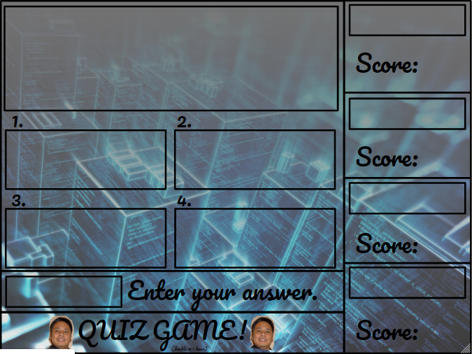

This project was created for EE205 the second course for Object-Oriented Programming where we used C++. The game has four categories which each contain 25 questions and allows up to four players. After choosing a category, the game randomizes the answers and selects the first player to type in their answer within a certain time. The game goes through the players in order until all the questions are answered and shows player scores at the end of the game.

For this project I created the user and info classes/header files. The user class held constructors so different players could be created and have their information initialized and edited. The info class held constructors to keep track of the scores of all the players and functions to edit scores.

Source: <a href="https://github.com/howtotailslide/EE205/tree/master/Project"><i class="large github icon "></i>EE205/tree/master/Project</a>

Below was a default background image for our quiz. It contained a section for the question text, a section for each category, a scoreboard for each player, and an area to enter the player's answer. A popular theme for final projects was adding the Professor's face.

